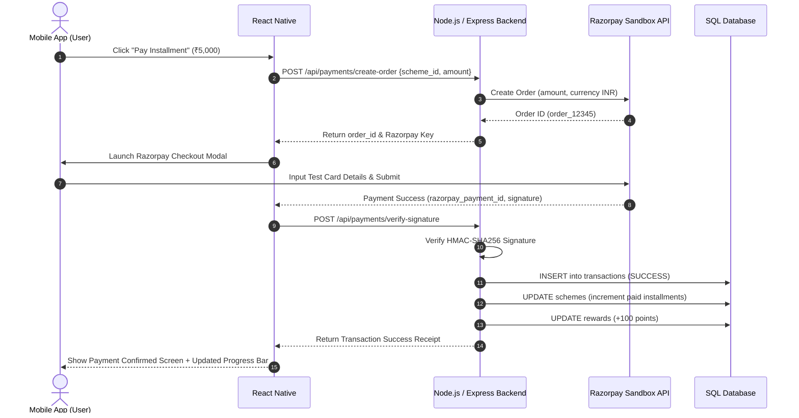
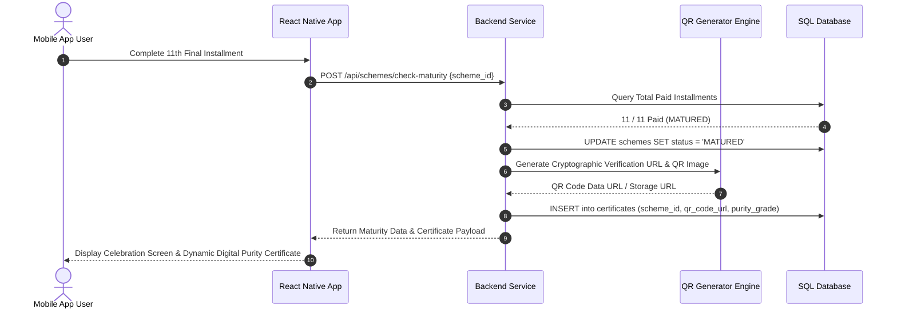

# Gemfinity – Jewellery Savings Scheme Mobile App: Comprehensive Project Plan & Architecture

Gemfinity is a cross-platform mobile application designed for jewellery retailers and customers to digitize traditional monthly jewellery savings schemes (Gold/Silver chit funds). The platform enables users to enroll in flexible monthly installment plans, process secure payments via Razorpay sandbox, track maturity progress, organize schemes into collections, earn loyalty reward points, generate cryptographic QR purity certificates, and receive automated installment push notifications.

---

## 1. System Specifications & Tech Stack

### Technology Stack Matrix
* **Frontend Mobile App:** React Native (v0.72+ / Expo SDK 49+), React Navigation v6, Redux Toolkit / React Query, `react-i18next` for localization.
* **Backend REST API:** Node.js (v18+) with Express.js, JSON Web Tokens (`jsonwebtoken`), `bcryptjs`, Razorpay Node SDK (`razorpay`), Firebase Admin SDK (`firebase-admin`), `qrcode` generator.
* **Database Layer:** PostgreSQL or MySQL (supported via `pg` / `mysql2` driver & Prisma ORM or Knex.js query builder).
* **Payment Gateway:** Razorpay API (Sandbox / Test Mode).
* **Authentication & Push Messaging:** Firebase Authentication (Phone OTP / Email-Password) & Firebase Cloud Messaging (FCM).

### Infrastructure & Deployment Strategy
* **Backend Server Hosting:** Render (Web Service Free Tier) or Heroku.
* **Managed Cloud Database:** Railway (PostgreSQL) or ClearDB / PlanetScale (MySQL).
* **Mobile Build Pipeline:** React Native CLI / Expo CLI generating release/debug `.apk` binaries for Android emulator and testing devices.

---

## 2. Database Design & Relational Schema

### Database Relational Schema (ER Diagram)
```mermaid
erDiagram
    USERS ||--o{ SCHEMES : "enrolls in"
    USERS ||--o{ TRANSACTIONS : "executes"
    USERS ||--o1 REWARDS : "owns"
    USERS ||--o{ CERTIFICATES : "receives"
    USERS ||--o{ COLLECTIONS : "manages"
    SCHEMES ||--o{ TRANSACTIONS : "contains"
    SCHEMES ||--o1 CERTIFICATES : "generates"

    USERS {
        bigint id PK
        string name
        string email UK
        string password_hash
        string language_pref
        string phone_number
        timestamp created_at
    }

    SCHEMES {
        bigint scheme_id PK
        bigint user_id FK
        decimal amount
        int duration_months
        date start_date
        date end_date
        decimal monthly_installment
        string status
    }

    TRANSACTIONS {
        bigint txn_id PK
        bigint user_id FK
        bigint scheme_id FK
        string razorpay_payment_id
        string razorpay_order_id
        decimal amount
        string status
        timestamp date
    }

    REWARDS {
        bigint reward_id PK
        bigint user_id FK
        int points
        boolean redeemed_status
        timestamp updated_at
    }

    CERTIFICATES {
        bigint cert_id PK
        bigint user_id FK
        bigint scheme_id FK
        string qr_code_url
        string purity_grade
        timestamp issue_date
    }

    COLLECTIONS {
        bigint collection_id PK
        bigint user_id FK
        string collection_name
        json scheme_ids
        boolean shared_status
    }
```

### SQL DDL Schema Definitions
```sql
-- 1. Users Table
CREATE TABLE users (
    id BIGSERIAL PRIMARY KEY,
    name VARCHAR(100) NOT NULL,
    email VARCHAR(150) UNIQUE NOT NULL,
    password_hash VARCHAR(255) NOT NULL,
    language_pref VARCHAR(10) DEFAULT 'en', -- 'en' or 'ta'
    phone_number VARCHAR(20),
    created_at TIMESTAMP WITH TIME ZONE DEFAULT CURRENT_TIMESTAMP,
    updated_at TIMESTAMP WITH TIME ZONE DEFAULT CURRENT_TIMESTAMP
);

-- 2. Schemes Table
CREATE TABLE schemes (
    scheme_id BIGSERIAL PRIMARY KEY,
    user_id BIGINT NOT NULL REFERENCES users(id) ON DELETE CASCADE,
    amount DECIMAL(12, 2) NOT NULL, -- Total scheme target value
    duration_months INT NOT NULL DEFAULT 11, -- Standard 11-month jewellery scheme
    monthly_installment DECIMAL(12, 2) NOT NULL,
    start_date DATE NOT NULL,
    end_date DATE NOT NULL,
    status VARCHAR(20) DEFAULT 'ACTIVE', -- 'ACTIVE', 'MATURED', 'CANCELLED'
    created_at TIMESTAMP WITH TIME ZONE DEFAULT CURRENT_TIMESTAMP
);

-- 3. Transactions Table
CREATE TABLE transactions (
    txn_id BIGSERIAL PRIMARY KEY,
    user_id BIGINT NOT NULL REFERENCES users(id) ON DELETE CASCADE,
    scheme_id BIGINT NOT NULL REFERENCES schemes(scheme_id) ON DELETE CASCADE,
    razorpay_payment_id VARCHAR(100),
    razorpay_order_id VARCHAR(100),
    amount DECIMAL(12, 2) NOT NULL,
    status VARCHAR(20) NOT NULL DEFAULT 'PENDING', -- 'PENDING', 'SUCCESS', 'FAILED'
    payment_method VARCHAR(50) DEFAULT 'RAZORPAY',
    date TIMESTAMP WITH TIME ZONE DEFAULT CURRENT_TIMESTAMP
);

-- 4. Rewards Table
CREATE TABLE rewards (
    reward_id BIGSERIAL PRIMARY KEY,
    user_id BIGINT NOT NULL REFERENCES users(id) ON DELETE CASCADE,
    points INT DEFAULT 0,
    redeemed_status BOOLEAN DEFAULT FALSE,
    updated_at TIMESTAMP WITH TIME ZONE DEFAULT CURRENT_TIMESTAMP
);

-- 5. Certificates Table
CREATE TABLE certificates (
    cert_id BIGSERIAL PRIMARY KEY,
    user_id BIGINT NOT NULL REFERENCES users(id) ON DELETE CASCADE,
    scheme_id BIGINT UNIQUE NOT NULL REFERENCES schemes(scheme_id) ON DELETE CASCADE,
    qr_code_url TEXT NOT NULL,
    purity_grade VARCHAR(50) DEFAULT '22K (916 Hallmarked)',
    issue_date TIMESTAMP WITH TIME ZONE DEFAULT CURRENT_TIMESTAMP
);

-- 6. Collections Table
CREATE TABLE collections (
    collection_id BIGSERIAL PRIMARY KEY,
    user_id BIGINT NOT NULL REFERENCES users(id) ON DELETE CASCADE,
    collection_name VARCHAR(100) NOT NULL,
    scheme_ids JSONB NOT NULL, -- Array of scheme_id integers e.g. [1, 4, 7]
    shared_status BOOLEAN DEFAULT FALSE,
    created_at TIMESTAMP WITH TIME ZONE DEFAULT CURRENT_TIMESTAMP
);
```

---

## 3. Core Feature Specifications

1. **User Authentication & Security**
   * Hybrid authentication supporting Firebase OTP / Email-Password login with JWT token issuance.
   * Secure credential storage via encrypted device storage (`react-native-encrypted-storage`).

2. **Scheme Enrollment System**
   * Flexible monthly savings plans (e.g., ₹1,000, ₹2,500, ₹5,000, ₹10,000 / month).
   * 11-Month Chit Benefit Model (Customer pays 11 monthly installments; retailer grants 12th installment bonus).
   * Real-time estimated weight/value projection at scheme initialization.

3. **Razorpay Payment Integration**
   * Native mobile checkout using Razorpay React Native SDK.
   * Server-side signature validation (`HMAC-SHA256`) to ensure transaction integrity.
   * Instant receipt generation and transaction history ledger.

4. **Savings Dashboard & Analytics**
   * Visual progress indicators (circular gauge & step progress bars showing "X of 11 paid").
   * Next installment due date alert widget and accumulated gold value tracker.

5. **Scheme Collections & Group Management**
   * Group active individual schemes into named custom collections (e.g., "Wedding Jewellery 2027", "Festival Savings").
   * Shared status toggle to allow family members to observe group savings milestones.

6. **Reminders & Push Notification Pipeline**
   * Scheduled background alerts triggered via Firebase Cloud Messaging (FCM).
   * Dynamic notifications for upcoming due dates (3 days prior), instant payment receipts, and maturity milestones.

7. **Rewards & Loyalty Points Engine**
   * Automatic reward points allotment upon timely monthly payment (+100 points/installment).
   * Tier status progression (Bronze, Silver, Gold, Platinum) with redeemable discounts on making charges.

8. **QR-Based Dynamic Purity Certificate Generation**
   * Cryptographic verification URL and dynamic QR code generated automatically when a scheme reaches maturity.
   * Digital 22K (916 Hallmarked) certificate viewer with PDF export and share options.

9. **Multi-Language Support (Localization)**
   * Full bilingual UI support for **English (`en`)** and **Tamil (`ta`)** using `i18next`.
   * Real-time language switching in settings, stored in `AsyncStorage` and synced with backend database.

---

## 4. Theme Design System & Brand Identity

### Brand Identity Matrix
* **Project Name:** Gemfinity
* **Taglines:** *"Save Smart. Shine Forever."* / *"Where Savings Sparkle."*
* **Logo Concept:** Interlocking gem facet icon blended with an infinity loop (`∞`), symbolizing infinite value growth, trust, and timeless jewellery savings.
* **Typography Pairing:**
  * Headings & Brand Logo: **Cinzel** / **Playfair Display** (Luxury Serif) for `"Gem"`
  * Controls & Body Text: **Outfit** / **Inter** (Sleek Sans-Serif) for `"finity"`

### Theme Variations

#### 1. Luxury Gold Theme (Primary Recommended)
* **Colors:** Metallic Gold (`#D4AF37`), Bright Gold (`#FFD700`), Deep Navy (`#001F3F`), Obsidian (`#121212`).
* **Aesthetic:** Radiant gold shimmer gradients, glassmorphism cards, premium dark mode luxury feel.

#### 2. Fintech Minimal Theme
* **Colors:** Pure White (`#FFFFFF`), Deep Teal (`#008080`), Navy (`#001F3F`), Slate (`#64748B`).
* **Aesthetic:** Clean banking interface, crisp modular cards, high readability.

#### 3. Trust & Community Theme
* **Colors:** Warm Ivory (`#FAFAF5`), Rose Gold (`#B76E79`), Deep Burgundy (`#4A0E17`), Soft Emerald (`#2E7D32`).
* **Aesthetic:** Soft traditional family trust design, warm pastel accents, heritage feel.

### Design Tokens Table
| Token Name | Color Code | Application |
| :--- | :--- | :--- |
| `primary-gold` | `#FFD700` | CTA buttons, active tab indicators, highlight borders |
| `primary-navy` | `#001F3F` | Top app bars, brand headers, high-emphasis text |
| `accent-teal` | `#008080` | Success tags, progress bars, payment confirmation state |
| `bg-dark` | `#0B132B` | Dark mode background canvas |
| `bg-light` | `#FAFAF5` | Light mode background canvas |
| `card-glass` | `rgba(255,255,255,0.08)` | Glassmorphism dashboard cards |

---

## 5. System Sequence Diagrams

### 1. Payment Verification Flow


### 2. QR Certificate Generation Flow


---

## 6. Resume-Friendly Project Summaries

### Software Engineer Resume Bullets
* **Gemfinity – Jewellery Savings Scheme Mobile App** | *React Native, Node.js, Express, MySQL/PostgreSQL, Razorpay, Firebase, Redux Toolkit*
  * Developed a cross-platform mobile application enabling customers to digitize monthly gold savings schemes with secure Razorpay sandbox payments.
  * Designed and normalized a relational database schema (MySQL/PostgreSQL) tracking users, scheme lifecycles, transaction ledgers, loyalty rewards, scheme collections, and purity certificates.
  * Integrated Firebase Cloud Messaging (FCM) for automated installment reminders and dynamic QR code generation for 22K gold purity certificates upon scheme maturity.
  * Built a bilingual UI supporting English and Tamil using `i18next`, featuring luxury gold theme design tokens and custom progress analytics.

### Single-Paragraph Resume Summary
> "Developed **Gemfinity**, a cross-platform mobile app for jewellery retailers to digitize customer savings schemes, featuring Razorpay sandbox payments, loyalty rewards, QR-based purity certificates, and collections. Built with React Native, Node.js, Express, and MySQL/PostgreSQL, deployed on Heroku/Render free tier with database hosting on Railway."
